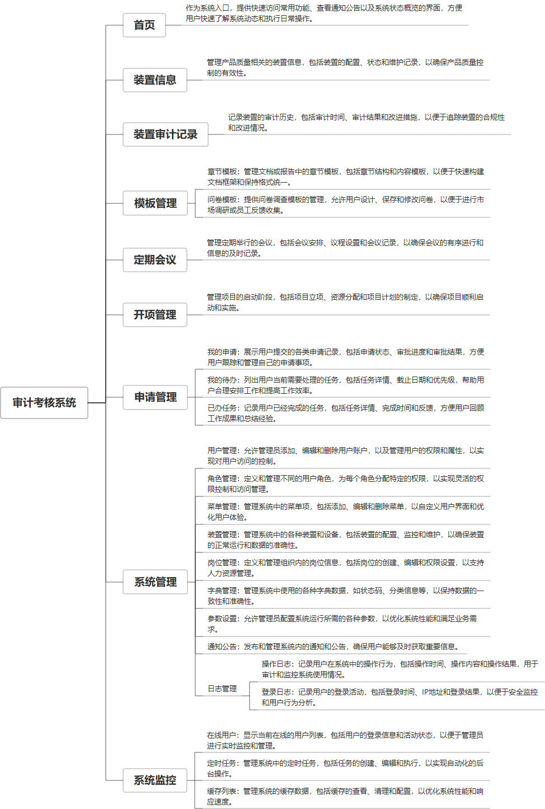

 

    
 

公司拥有上百套具有自主知识产权的软件系统，详情请查看码云首页或公司官网

 
<h1>工厂安全审计系统</h1>

<a href="https://www.haishi.net.cn/">公司官网</a> ｜ <a href="https://www.haishi.net.cn/">在线体验</a>

 

## 系统介绍

装置审查系统是一款专业的审计与设备管理工具，它集成了装置信息管理、审计记录处理、定期会议安排以及各类模板的维护功能。系统支持装置信息的查询、新增、修改、删除和导出，同时提供审计记录的全程管理，包括查询、新增、修改、删除和导出操作。此外，系统还涵盖了开项管理、章节模板、问卷模板的全面维护，以及申请和任务流程的监控，确保审计流程的规范性和设备信息的准确性，为企业提供高效的审查流程和决策支持。
None
                

## 系统功能介绍

### 系统包含终端说明

管理端（WEB）

管理端（WEB）
管理端（WEB）
| 序号 | 模块 | 模块说明 |
| --- | --- | --- |
| 1 | GC-ZHSJ-SJKH-MANAGE | 管理端 |
| 2 | GC-ZHSJ-SJKH-SERVER | 服务端 |

### 系统功能结构

### 系统功能说明

- 装置信息管理：对企业内部各个装置的基本信息进行管理，方便审计人员查阅和记录。
- 审计记录：记录每次审计活动的详细内容，包括审计时间、审计人员、审计对象、审计结果等，形成完整的审计链条。
- 模板管理：提供章节模板和问卷模板，方便审计人员快速创建审计问卷和报告，提高审计效率。
- 定期会议：记录定期会议的内容和决议，跟踪审计问题的整改情况。
- 开项管理：对审计项目的立项、执行、完成等环节进行管理，确保审计项目的顺利进行。
- 申请管理：员工可以通过系统提交申请，管理人员进行审批，方便快捷。

## 系统主要界面

## 系统技术说明

### 代码模块说明

| 序号 | 目录 | 目录说明 |
| --- | --- | --- |
| 1 | GC-ZHSJ-SJKH-SERVER/rc-quartz | -- |
| 2 | GC-ZHSJ-SJKH-SERVER/rc-common | -- |
| 3 | GC-ZHSJ-SJKH-SERVER/rc-system | -- |
| 4 | GC-ZHSJ-SJKH-SERVER/rc-generator | -- |
| 5 | GC-ZHSJ-SJKH-SERVER/rc-buisness | -- |
| 6 | GC-ZHSJ-SJKH-SERVER/rc-framework | -- |
| 7 | GC-ZHSJ-SJKH-SERVER/rc-admin | -- |
| 8 | GC-ZHSJ-SJKH-SERVER/.idea | -- |

### 系统技术选型

#### 开发语言/框架

JAVA（JDK1.8）
前端框架：VUE2

#### 服务中间件

Nginx
Tomcat

#### 数据库

MySQL（5.7+）

#### 其他说明

无

## 系统演示/商用

请扫码添加客服微信获取演示地址和系统详细资料。

如果您想基于工厂安全审计系统进行商业化交付或定制开发服务，我们提供有偿的技术服务支持，合作模式不限，欢迎沟通！

公司官网地址： <a href="https://www.haishi.net.cn/">https://www.haishi.net.cn</a>

联系客服获取专业回答。

## 使用须知

1、 本项目商用必须获得版权所有者的授权。

2、 未经允许本项目代码不允许二次出售。

